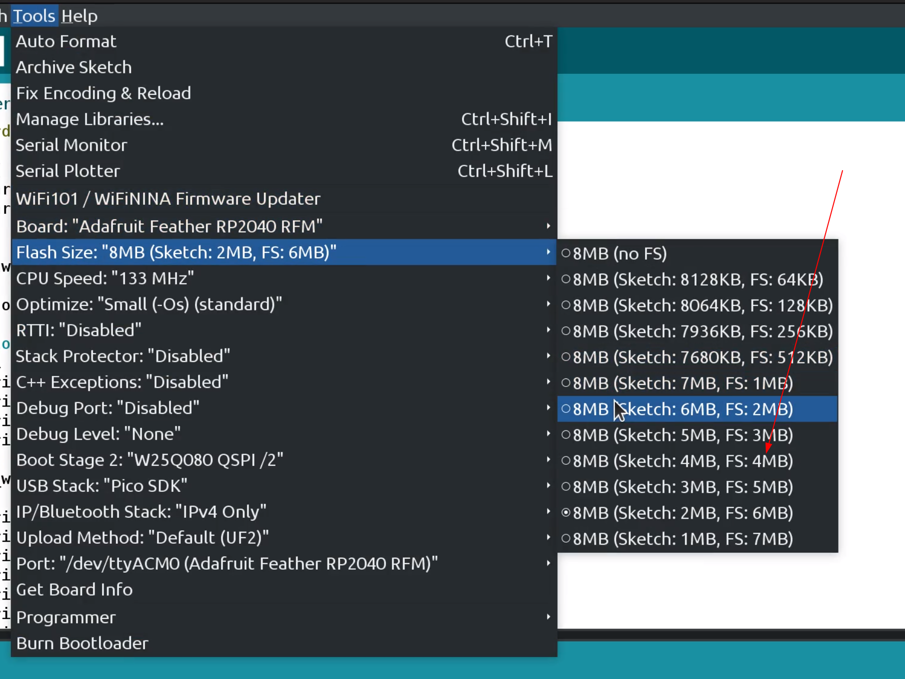
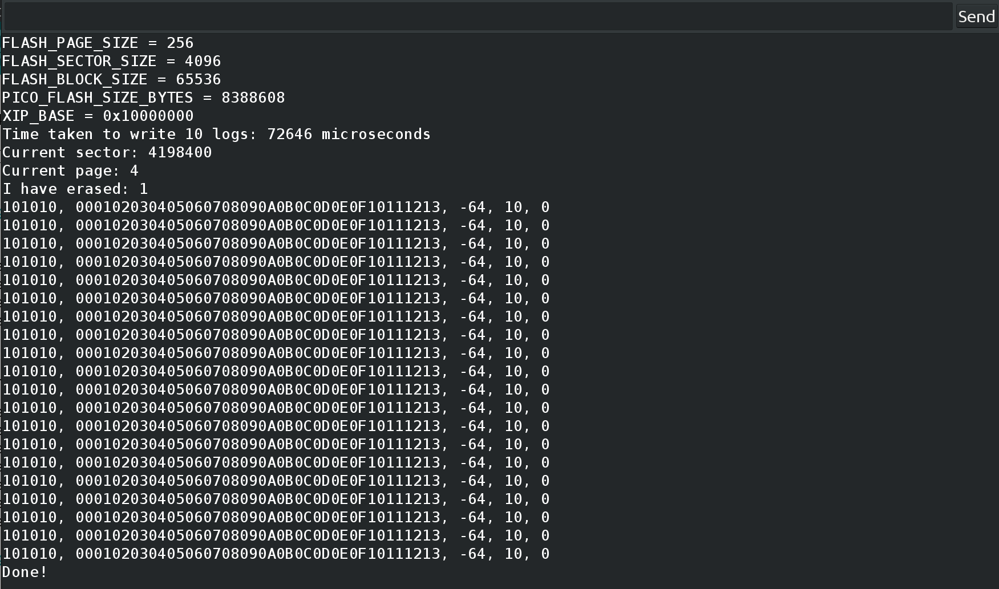

# rp2040_flash_datalogger

## Overview

This library provides an easy way to log data directly into the flash memory of arduino sketches running on RP2040 platforms (Adafruit Feather RP2040, Arduino Pico). It consists of two main classes: `FlashWriter` and `FlashReader`, allowing for efficient writing and reading of data to and from the flash memory.

## Features

- **FlashWriter**: Enables writing strings and formatted data to flash memory.
- **FlashReader**: Facilitates reading data back from the flash memory.

## Usage

### FlashWriter

- Initialize with `FlashWriter writer;`.
- Write data using `writer.print("data")`, `writer.println("data")`, or `writer.printf("formatted string", ...)`.
- Writing a `\n` forces flushing of data to a page in flash memory. `writer.println` has the same effect.
- If `\n` is not written, the data will not be written to flash unless internal buffers (256 bytes) exceed.
- Data is written to flash memory in pages, and the writer goes sector-by-sector, implementing a rudimentary round-robin wear leveling logic.

`FlashWriter` treats the flash as a circular buffer. If the `FlashWriter` gets to the end of memory, it will cycle back to the start (`4 MB` mark). It **will wipe past data** if too much data is written.

Methods:

- `print(String)`: Writes a string to flash memory.
- `println(String)`: Writes a string to flash memory with a newline.
- `printf(const char *, ...)`: Writes formatted data to flash memory.

### FlashReader

- Initialize with `FlashReader reader;`.
- Read data using `String data = reader.read();`.

Methods:

- `read()`: Reads data from flash memory as a string.

## Installation

- Clone this git repository in your `Arduino/libraries/` folder.
- Include `#include <rp2040_flash_datalogger.h>` in your Arduino sketch.
- The library currently expects the latter 4 MB of the flash to be completely available for use. Use the Arduino IDE to give at least 4 MB of space to the `FS`. 

## Examples

The library comes with two examples:

- `flash_writer`: This example demonstrates different methods to write to flash, and how data can be read till the first empty memory block. Example screenshot: 
- `flash_formatter`: This utility should be used with caution (it can erase large amounts of data on your flash). It will clear all sectors until the first empty sector.

## Notes

- This library is designed for use with Arduino IDE on devices with RP2040.
- Calling writes to flash memory involves disabling and enabling interrupts, this might disrupt other functions. Test this out before use.
- RP2040 supports file-system libraries like [SDFS](https://arduino-pico.readthedocs.io/en/latest/fs.html#flash-layout). These are more robust and better documented, but will be about 10x slower.
- [Makermatrix's blog](https://www.makermatrix.com/blog/read-and-write-data-with-the-pi-pico-onboard-flash/) provided the basis for this implementation

```
MIT License.
Raghav Subbaraman <rsubbaraman@eng.ucsd.edu>
```
